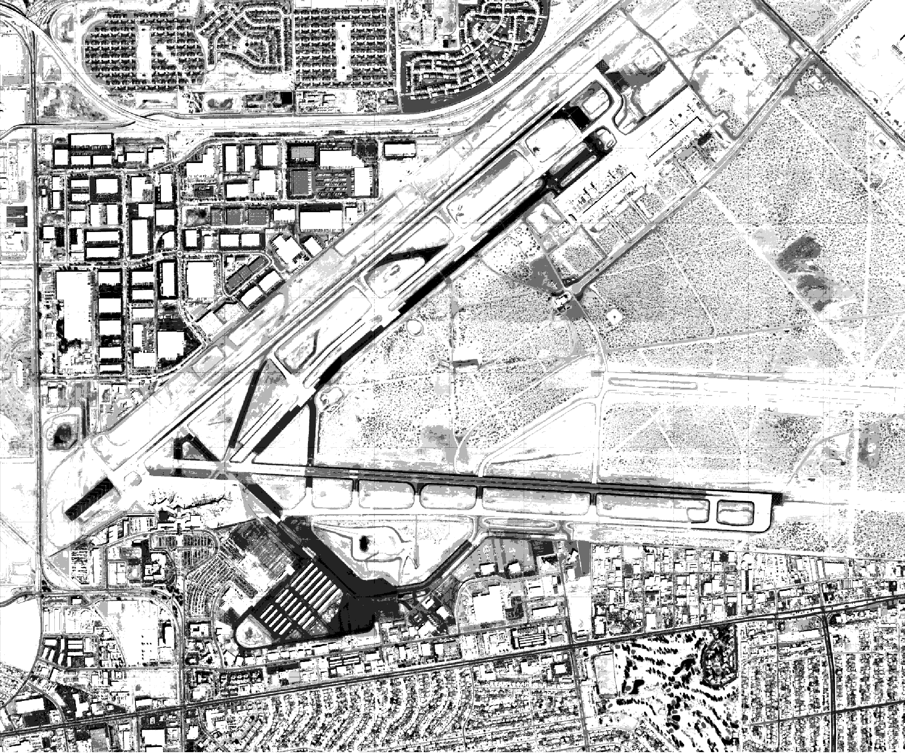
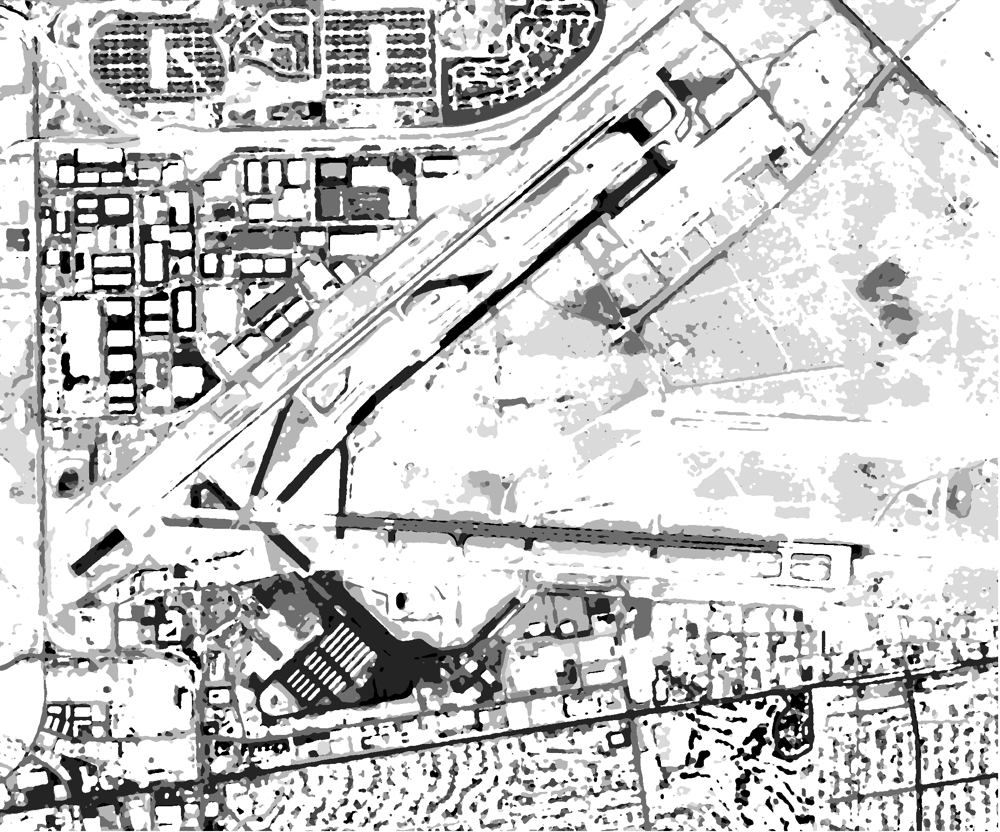
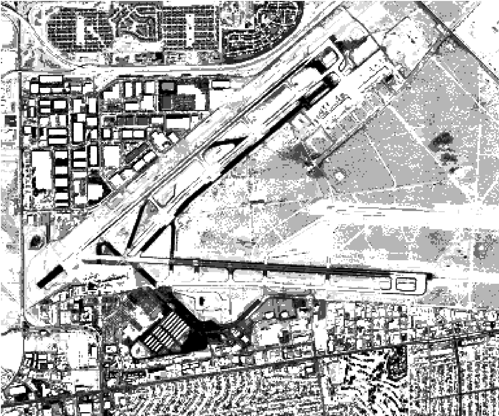
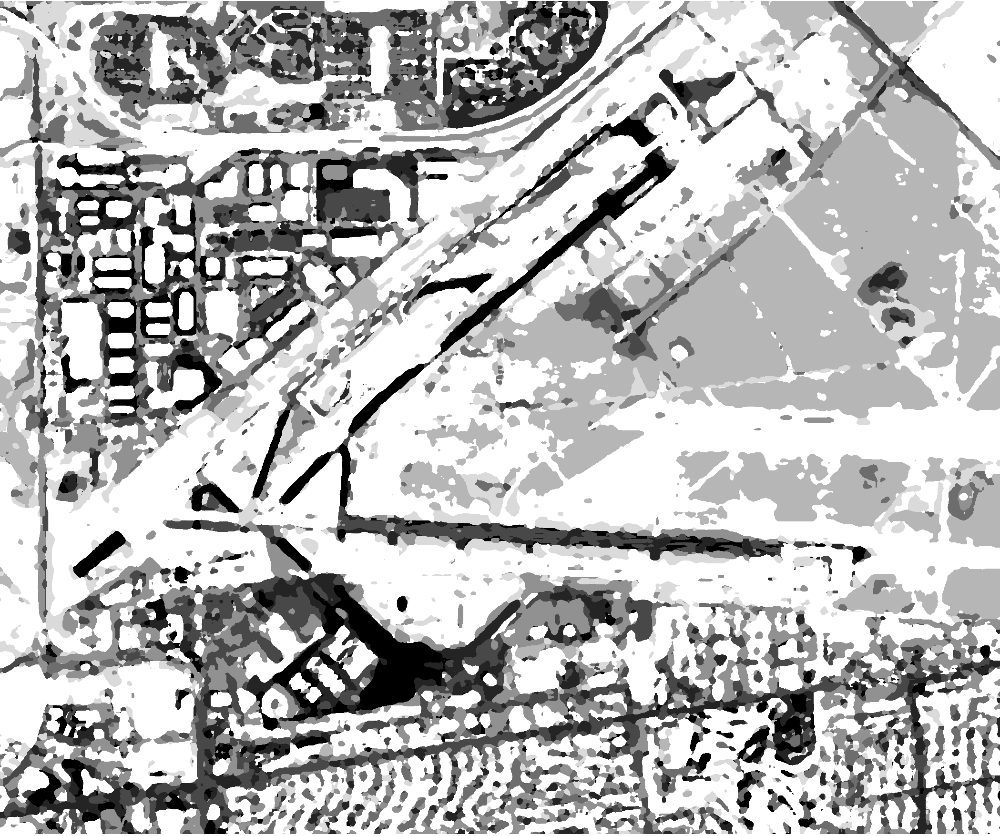

# QGIS Map Segmentation
A [Quant Civil](https://www.quantcivil.ai) product

Turn map imagery into **unlabeled segments** (regions) in a few clicks. The plugin performs **K-Means** clustering on RGB imagery to produce a segmented raster overlay you can use for quick land-cover style workflows, delineation, and downstream analysis.

---

## What this plugin does
Given an RGB raster, the plugin produces a labeled segmentation map with **N segments** (bins). Each pixel is assigned to one of the segment IDs, creating coherent regions.

- **Fast, practical segmentation** for everyday use
- Works on **large rasters** via chunked processing
- **Optional smoothing** to reduce speckle (disabled by default)

---

## Input types (two valid flows)

### 1) Raster input (direct)
Select a **3-band RGB GeoTIFF raster** layer. Segmentation runs directly on that raster.

### 2) Map / web service input (assisted conversion)
If you select a **non-raster** layer (e.g., WMS/WMTS/XYZ/ArcGIS services, or other map-rendered layers), the plugin will automatically open QGIS **Convert map to raster** with:
- **Extent:** current map canvas extent  
- **Layer:** the selected layer  
- **Density:** **1.0 map unit per pixel**

The dialog **does not auto-run**—it simply opens prefilled so you can adjust parameters and run it manually. Once the output raster is created and added to your project, select it as the input layer and segment normally.

---

## Controls

### Number of segments
Controls how many regions (bins) the output will contain.
- Fewer segments → broader regions (simpler map)
- More segments → more granular separation (more detail / potentially more speckle)

### Resolution
Controls the **analysis resolution** used for segmentation.
- Higher resolution → captures smaller features, costs more compute
- Lower resolution → smoother/coarser regions, faster

### Smoothing (optional)
Smoothing is **disabled by default**. When enabled, it reduces isolated “salt-and-pepper” noise in the output.
- Lower smoothing → preserves small details, may look noisier
- Higher smoothing → cleaner regions, can remove small features

---

## Quick start
1. Open the plugin panel.
2. Choose an **Input Layer** (raster or map service).
   - If you choose a map service, run **Convert map to raster** (dialog opens automatically).
3. Choose **Resolution**.
4. Set **Number of segments**.
5. (Optional) Enable **Smoothing** and choose a smoothing level.
6. Click **Segment**. A segmented raster layer is added to your project.

---

## Example: resolution × smoothing

### Source imagery
The following satellite image is the input used for the examples below:

---

### High resolution, smoothing OFF
High resolution retains small features, but can show more speckle/texture because the clustering is operating at finer detail.

---

### High resolution, smoothing MAX
Max smoothing produces cleaner regions and reduces speckle, but may remove or soften small structures.

---

### Low resolution, smoothing OFF
Low resolution produces larger, more stable regions with fewer tiny fragments. It’s usually faster and can be easier to interpret, but loses small details.

---

### Low resolution, smoothing MIN
Medium smoothing at low resolution can reduce leftover speckle while still keeping the “coarse” structure intact.

---

## Notes & tips
- If you care about **small features**, prefer **higher resolution** and keep **smoothing off or low**.
- If you want **clean regions quickly**, use **lower resolution** and enable **smoothing**.
- For map/web-service layers, the assisted conversion flow removes the manual “export raster first” step—use it to iterate rapidly on extents.

---

## License
BSD-3-Clause (see repository license file).